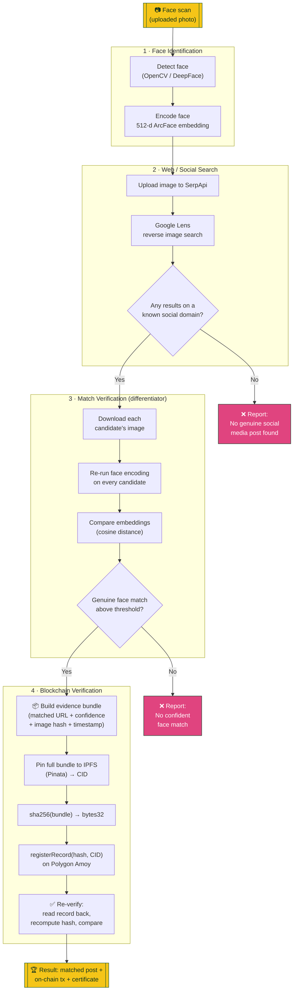

# HH Signal — Face Identification & Blockchain Verification 

Built for **HH Goa 2026, Shortlisting Task 3** (Submitted by HackWave Team).

A pipeline that takes a face scan, finds a genuinely matching social media
post via a real reverse-image search, and writes a tamper-evident record of
that discovery to a public blockchain — with live re-verification.

## System architecture



**Plain-language walkthrough:**

1. **You upload a face photo.** The app detects the face and turns it into a
   512-number "fingerprint" (embedding) using ArcFace — this fingerprint is
   what gets compared later, not the raw photo.
2. **The photo is searched on the web** via Google Lens (through SerpApi),
   which returns pages that visually contain a similar image.
3. **Every candidate result is double-checked.** Instead of trusting "looks
   similar," the app downloads each candidate's image, runs the same face
   fingerprinting on it, and only keeps candidates whose fingerprint is
   close enough to the original to be confidently the same person, *and*
   whose link is on an actual social media platform.
4. **The evidence is packaged and stored.** The winning match (URL,
   confidence score, image hash, timestamp) is saved as a small JSON
   "evidence bundle," pinned to IPFS (permanent, content-addressed
   storage), and only that bundle's cryptographic hash + its IPFS location
   are written to a smart contract on the Polygon Amoy blockchain.
5. **Anyone can re-verify, forever.** Because the hash is on a public
   blockchain, you (or a judge, or anyone) can re-fetch the evidence,
   recompute its hash, and compare it to the on-chain value at any time —
   if even one byte of the evidence changed, the hashes won't match.

## What makes this different from "call an API, call a blockchain"

- **Two-layer verification.** A reverse-image hit is not treated as a match
  on its own. Every candidate post's image is downloaded and re-run through
  face recognition; only a genuine face-embedding match (cosine distance
  below threshold) is accepted. This is what makes "found matching post"
  actually trustworthy.
- **Strictly social.** If no candidate is on a known social-media domain,
  the pipeline reports "no genuine social media post found" rather than
  silently substituting a blog, news article, or Wikipedia page.
- **Hash-on-chain, data-on-IPFS.** The full evidence bundle (matched URL,
  confidence score, image hash, timestamp) is pinned to IPFS; only its
  SHA-256 hash and IPFS CID go on-chain — a standard, gas-efficient pattern.
- **Live tamper-evidence demo.** The UI includes a "Tamper Test" button that
  alters a copy of the evidence and shows the on-chain hash comparison
  catching it — a direct, visible demonstration of "re-verifying," not just
  an automated one-shot check.
- **Verification certificate.** A downloadable PNG certificate (matched
  post, confidence score, on-chain record, QR code to the PolygonScan tx)
  ties the whole result together.

## Blockchain used

**Polygon Amoy testnet** (public, chain ID `80002`).

- Contract: [`VerificationRegistry.sol`](contracts/VerificationRegistry.sol) —
  `registerRecord(bytes32 dataHash, string ipfsCID)`, `getRecord(id)`,
  `verifyHash(id, dataHash)`.
- Deployed at:
  [`0xD9C3D1A975Df4c55D3eC0a300F0A4f2961a9f699`](https://amoy.polygonscan.com/address/0xD9C3D1A975Df4c55D3eC0a300F0A4f2961a9f699)
- Chosen because it's a real, public, independently-checkable testnet
  (anyone can open the PolygonScan link and see the record) with fast block
  times (~2s) and a free faucet, rather than a purely local/simulated chain.

## Tech stack

| Layer | Choice |
|---|---|
| Face detection/embedding | `DeepFace` (ArcFace model) |
| Web/social search | `SerpApi` Google Lens engine |
| Blockchain | Polygon Amoy + `web3.py` + Solidity (`py-solc-x`) |
| Off-chain evidence storage | IPFS via Pinata |
| UI | Streamlit, custom HH Goa-themed CSS |
| Certificate | Pillow + `qrcode` |

## Project structure

```
contracts/VerificationRegistry.sol   Solidity contract
scripts/deploy_contract.py           Compile + deploy to Amoy
src/face/                            Detection (detector.py) + ArcFace encoding (encoder.py)
src/search/                          SerpApi client, image hosting (Pinata), cache, match verification
src/blockchain/                      web3.py client, hashing, ABI
src/storage/                         IPFS pinning
src/certificate/                     Certificate + QR generation
src/pipeline.py                      Orchestrates the full pipeline end-to-end
app/streamlit_app.py + theme.css     HH Goa-themed UI
tests/                                pytest suite (21 tests)
```

## How to run

### 1. Setup

```bash
python -m venv venv
./venv/Scripts/pip install -r requirements.txt   # Windows
# source venv/bin/activate && pip install -r requirements.txt   # macOS/Linux
```

Copy `.env.example` to `.env` and fill in:

- `SERPAPI_API_KEY` — from [serpapi.com](https://serpapi.com) (free trial: 100 searches)
- `WALLET_PRIVATE_KEY` / `WALLET_ADDRESS` — a **fresh testnet-only** wallet
  (e.g. a new MetaMask account), funded with free Amoy test MATIC from
  [faucet.polygon.technology](https://faucet.polygon.technology) or
  [alchemy.com/faucets/polygon-amoy](https://www.alchemy.com/faucets/polygon-amoy)
- `PINATA_JWT` — from [pinata.cloud](https://pinata.cloud) (free tier)
- `CONTRACT_ADDRESS` — already deployed; use
  `0xD9C3D1A975Df4c55D3eC0a300F0A4f2961a9f699`, or deploy your own (below)

### 2. (Optional) Deploy your own contract instance

```bash
./venv/Scripts/python.exe scripts/deploy_contract.py
```

Prints the new contract address — paste it into `.env` as `CONTRACT_ADDRESS`.

### 3. Run the app

```bash
./venv/Scripts/streamlit.exe run app/streamlit_app.py
```

Upload a face photo, click **Run Verification Pipeline**, watch the 6 live
stages complete, then use **Re-verify Now** / **Run Tamper Test** to prove
the on-chain record is tamper-evident, and download the certificate.

### 4. Run tests

```bash
./venv/Scripts/python.exe -m pytest tests/ -v
```

Most tests are network-free (mocked); a few hit live but free/read-only
endpoints (Pinata fetch, on-chain `verifyHash` view calls) and skip
gracefully if unreachable.

## Known limitations

- **Not every face has an indexable social presence.** Reverse image search
  can only find posts that are actually publicly indexed by Google Lens. A
  private individual with no public social footprint will correctly produce
  "no genuine social media post found" rather than a forced/false match —
  this is intentional honesty, not a bug.
- **SerpApi free-tier quota.** The default trial key has a limited number of
  searches; heavy repeated testing can exhaust it faster than expected.
- **Network dependency.** SerpApi, Pinata, and the Amoy RPC all require
  internet access; there is no offline fallback.
- **Amoy RPC endpoint.** The official `rpc-amoy.polygon.technology` did not
  resolve in our development environment's DNS; `config.py` defaults to
  `polygon-amoy-bor-rpc.publicnode.com` instead. If that endpoint is ever
  degraded, swap `AMOY_RPC_URL` in `.env` for another public Amoy RPC.
- **Query image size cap for search.** SerpApi's image-upload endpoint caps
  uploads at 500KB, so `serpapi_client.py` re-encodes/downscales the query
  image before searching. This only affects the search step's copy of the
  image, not face detection accuracy (which runs on the original) or the
  evidence bundle (which stores a hash of the original file).
- **Face matching threshold is fixed** (`FACE_MATCH_DISTANCE_THRESHOLD` in
  `src/config.py`, ArcFace cosine distance ≤ 0.68). It was tuned against a
  handful of real test images, not a large validation set.
